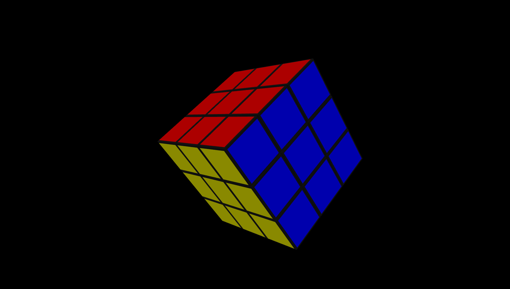

# 🧩 Realistic 3D Rubik’s Cube (Three.js + GSAP)

A **fully interactive 3D Rubik’s Cube** built using **Three.js**, **GSAP**, and vanilla **HTML/CSS**.  
Rotate the entire cube freely with your mouse, and **click + drag** any cube face to twist it —  
just like a real-world Rubik’s Cube!

## 🚀 Features

✅ **Realistic 3D Cube**  
- Built using `Three.js` 3D graphics library.  
- Smooth, polished surfaces with realistic reflections and lighting.  

✅ **Mouse Controls**  
- Move your mouse to **rotate the cube** freely in 3D space.  
- Click and drag on any cube face to **rotate that layer**.  

✅ **Authentic Look**  
- 6 colored sides: Green, Blue, Red, Orange, White, Yellow.  
- Matte black cube base with glossy color tiles.  
- Dynamic lighting, soft shadows, and clean background.  

✅ **Interactive Mechanics**  
- Face detection and rotation groups using raycasting.  
- GSAP-powered animations for smooth face rotations.  

✅ **Optimized Performance**  
- Lightweight scene setup.  
- Runs smoothly in browsers supporting WebGL.  

## 🧠 Technologies Used

| Technology | Purpose |
|-------------|----------|
| **Three.js** | Core 3D rendering and geometry manipulation |
| **GSAP** | Smooth animations for cube face rotation |
| **HTML5 Canvas** | Rendering surface for 3D content |
| **CSS3** | Styling, layout, and user interaction |
| **JavaScript (ES6)** | Main logic, interactivity, and rotation mechanics |

## 🛠️ Installation & Setup

1. **Clone the repository**
   ```bash
   git clone https://github.com/ABI2006S/3d-rubiks-cube.git
   cd 3d-rubiks-cube
   
2. **Run Locally**
  ```bash  
   npx live-server
   ```
3. **Play**

## 🕹️Controls
| Action           | Description                                 |
| ---------------- | ------------------------------------------- |
| 🖱️ Move Mouse   | Rotate the entire cube in 3D                |
| 🖱️ Click + Drag | Rotate a cube face along the drag direction |
| 🔄 (Coming Soon) | Scramble and auto-solve features            |

## 📁 Project Structure

📦 3d-rubiks-cube
├── index.html          # Main entry point
├── style.css           # Styles and layout
├── script.js           # Core logic (Three.js + GSAP)
├── README.md           # Project documentation
└── /screenshots        # Optional screenshots for README

## 🔮 Planned Enhancements

- 🌀 **Scramble Button** – Randomizes the cube  
- ⏱️ **Timer** – Track solve time  
- 🤖 **Auto-solver** – Visual solving animation  
- 🎨 **Themes** – Change cube color palettes  
- 📱 **Touch Support** – Full mobile compatibility  

## 🧑‍💻 Author

**Abin Varughese John**  
💻 [GitHub Profile](https://github.com/ABI2006S)  
📧 5amvibezofficial@gmail.com

> Made with ❤️ using **Three.js**, **GSAP**, and curiosity.
